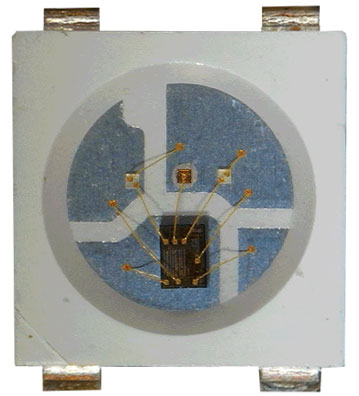
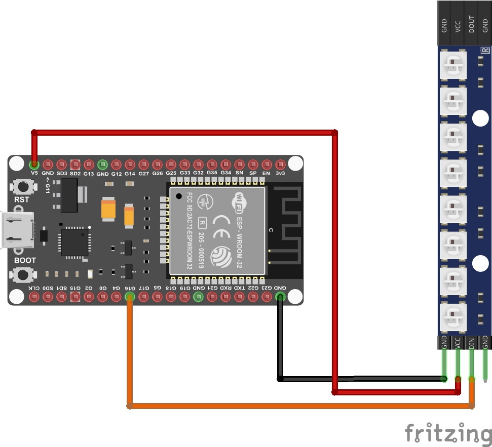

# Projeto: ESP32S Controlando Fita de LEDs Endereçáveis NeoPixel WS2812B com 8 LEDs

 

## Descrição

Neste projeto vamos utilizar um microcontrolador ESP32S para gerar efeitos coloridos numa fita de LEDs endereçáveis, com código criado na Arduino IDE.

## Introdução

Quando você precisa de uma solução de iluminação dinâmica, as fitas de LED são uma ótima opção. Elas podem ser montadas em praticamente qualquer lugar, estão disponíveis em uma variedade de cores e exigem pouquíssima manutenção. Encontrar outro sistema de iluminação que ofereça tanto valor e estilo seria um desafio. E mesmo esse padrão é elevado a um patamar completamente novo pelas fitas de LED endereçáveis. Elas oferecem mais opções de controle e efeitos divertidos para adicionar ainda mais brilho à sua configuração de iluminação. Esses LEDs endereçáveis ​​podem ser facilmente controlados por um microcontrolador.

## Modulo WS2812B

Abaixo temos a imagem real de um LED WS2812B. A matriz WS2812B está conectada a 3 LEDs individuais, Vermelho, Verde e Azul, usando fios dourados.

E aqui, o módulo funcionando:

)

#### Pinagem da Barra de LEDs WS2812B com 8 LEDS Endereçáveis

|Pino|Descrição|
| :---: | :---: |
|VCC|Conecte este pino à fonte de alimentação do dispositivo (5 V).|
|GND|Este pino deve ser conectado ao terra (GND) do microcontrolador ou à fonte de alimentação.|
|DIN|Este pino é usado para controle dos LEDs pelo microcontrolador|
|DOUT|Este pino é usado conectar a próxima barra de LEDs, através da entrada IN, colocando as barras em série.|

## Pré-requisitos
* Ter a [IDE](https://www.arduino.cc/en/software/) do Arduino instalada e configurada;
* Instalar a biblioteca Adafruit_NeoPixel e todas as suas dependencias;

## Material Necessário
* Microcontrolador ESP32 ou ESP32s;
* Barra de LEDs Endereçáveis com 8 módulos WS2812B;
* Protoboard e jumpers;
* Cabo de dados para conexão do microcontrolador ao PC.

## Tabela de Conexões

|Pinos do ESP32S|Pinos da Barra de LEDs|
| :---: | :---: |
|5 V (19)|VCC (2)|
|GND (38)|GND (1)|
|GPIO16 (27)|DIN (3)|

## Imagem das Conexões

## Foto do Projeto

